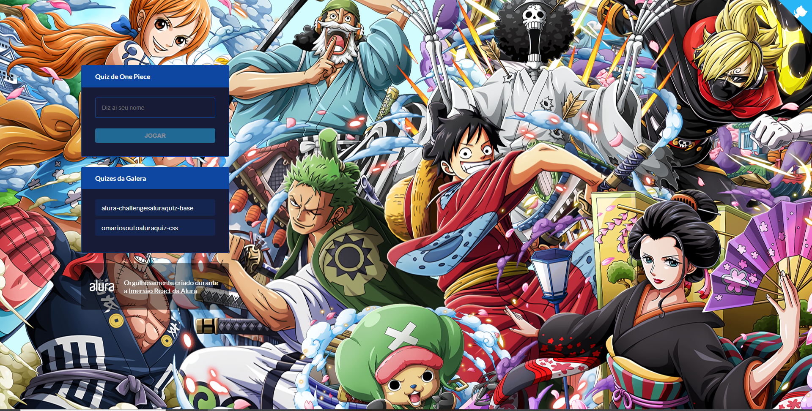

# One Piece Quiz

Desenvolvido durante a Imersão React 2.0 da <a href="https://www.alura.com.br/">Alura</a> focado em Next.js.

## Deploy feito na <a href="https://vercel.com/">Vercel</a>
<a href="https://ascejsquiz.pdrolucasz.vercel.app/">Acesse para jogar o quiz</a>

# Tecnologias
<ul>
  <li>ReactJS</li>
  <li>Next.js</li>
  <li>Styled Components</li>
  <li>Framer Motion</li>
</ul>

# Instalação

<strong>
  Necessário um instalador de pacotes, utilizei nesse projeto o <a href="https://yarnpkg.com/">Yarn</a>.
  Para clonar o projeto usando HTTPS, use este comando:
</strong>

<pre>
  git clone https://github.com/pdrolucasz/ascejsquiz.git
</pre>

<strong>Navegue até a pasta do projeto e instale as dependências usando esse comando: </strong>

<pre>
  yarn

  # caso esteja usando npm
  npm install 
</pre>

<strong>Para iniciar a aplicação em ambiente de desenvolvimento, utilize esse comando:</strong>

<pre>
  # http://localhost:3000/
  yarn next
</pre>